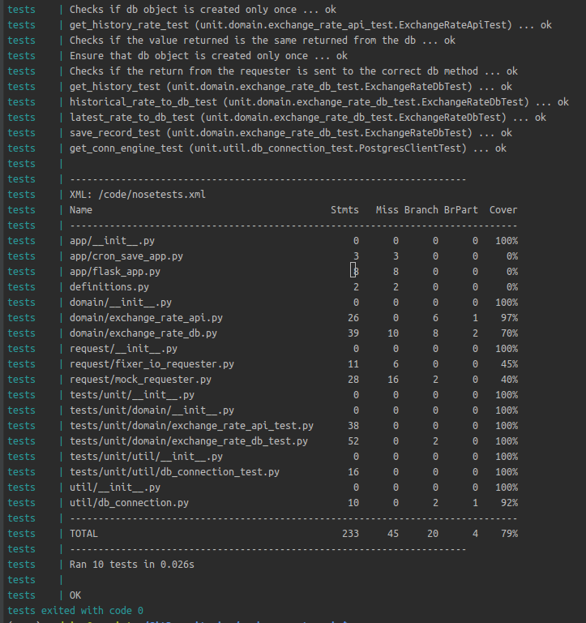
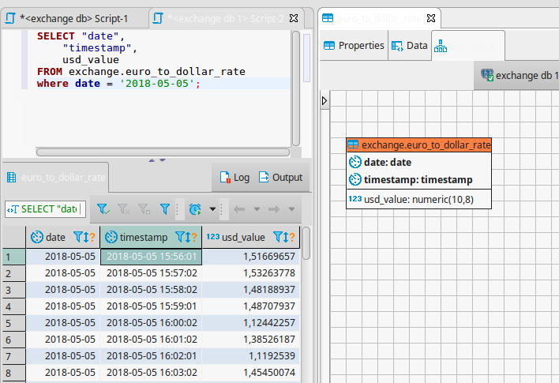

# exchange-rate-api

This project creates a microservice with docker and python flask to extract exchange rate from a API.

### How to use

For the moment, this is hosted in a AWS EC2. 
Just have to call the two existing endpoints:

- /latest: Contains the latest exchange rate extraction.
Example:
```
curl http://ec2-52-55-75-78.compute-1.amazonaws.com:5000/latest
{'date': datetime.datetime(2018, 5, 5, 19, 1, 2), 'usd_value': 1.51476861}(
```

- /history/start=[start]&end=[end]: Contains the exchange rate's history. 
Example:
```
curl "http://ec2-52-55-75-78.compute-1.amazonaws.com:5000/history?start=2018-01-01&end=2018-05-05"
[{'date': datetime.date(2018, 1, 1), 'timestamp': datetime.datetime(2018, 1, 1, 0, 0), 'usd_value': 13.47015168}, 
 {'date': datetime.date(2018, 1, 2), 'timestamp': datetime.datetime(2018, 1, 2, 0, 0), 'usd_value': 98.7553032}, 
 {'date': datetime.date(2018, 1, 3), 'timestamp': datetime.datetime(2018, 1, 3, 0, 0), 'usd_value': 43.78518016}, 
 {'date': datetime.date(2018, 1, 4), 'timestamp': datetime.datetime(2018, 1, 4, 0, 0), 'usd_value': 74.8790463}, 
 {'date': datetime.date(2018, 1, 5), 'timestamp': datetime.datetime(2018, 1, 5, 0, 0), 'usd_value': 60.52952432}, 
 {'date': datetime.date(2018, 1, 6), 'timestamp': datetime.datetime(2018, 1, 6, 0, 0), 'usd_value': 64.94465472}, 
 {'date': datetime.date(2018, 1, 7), 'timestamp': datetime.datetime(2018, 1, 7, 0, 0), 'usd_value': 66.23131448}, 
 {'date': datetime.date(2018, 1, 8), 'timestamp': datetime.datetime(2018, 1, 8, 0, 0), 'usd_value': 25.45280224}, 
 {'date': datetime.date(2018, 1, 9), 'timestamp': datetime.datetime(2018, 1, 9, 0, 0), 'usd_value': 71.22347826}, 
 {'date': datetime.date(2018, 1, 10), 'timestamp': datetime.datetime(2018, 1, 10, 0, 0), 'usd_value': 67.15890014}, 
 {'date': datetime.date(2018, 1, 11), 'timestamp': datetime.datetime(2018, 1, 11, 0, 0), 'usd_value': 88.30803692}, 
 {'date': datetime.date(2018, 1, 12), 'timestamp': datetime.datetime(2018, 1, 12, 0, 0), 'usd_value': 37.1805641}, 
 {'date': datetime.date(2018, 1, 13), 'timestamp': datetime.datetime(2018, 1, 13, 0, 0), 'usd_value': 37.48027312}, 
 {'date': datetime.date(2018, 1, 14), 'timestamp': datetime.datetime(2018, 1, 14, 0, 0), 'usd_value': 17.2609843}, 
 {'date': datetime.date(2018, 1, 15), 'timestamp': datetime.datetime(2018, 1, 15, 0, 0), 'usd_value': 59.58310456}, 
 {'date': datetime.date(2018, 1, 16), 'timestamp': datetime.datetime(2018, 1, 16, 0, 0), 'usd_value': 47.66351836}, 
 {'date': datetime.date(2018, 1, 17), 'timestamp': datetime.datetime(2018, 1, 17, 0, 0), 'usd_value': 94.37231928}, 
 {'date': datetime.date(2018, 1, 18), 'timestamp': datetime.datetime(2018, 1, 18, 0, 0), 'usd_value': 49.35944552}, 
 {'date': datetime.date(2018, 1, 19), 'timestamp': datetime.datetime(2018, 1, 19, 0, 0), 'usd_value': 74.94944136}, 
 {'date': datetime.date(2018, 1, 20), 'timestamp': datetime.datetime(2018, 1, 20, 0, 0), 'usd_value': 45.79124944}, 
 {'date': datetime.date(2018, 5, 5), 'timestamp': datetime.datetime(2018, 5, 5, 19, 4, 2), 'usd_value': 1.75553025}]
```

### How to install/deploy with docker

#### Prerequisites:
- make, docker and docker-compose binaries installed;
- Set the frequency of data extraction on 'conf/app_environ.conf'
- You can check the 'conf/app_environ.conf' in case you wish to connect to the db later.

```
git clone https://github.com/rodrigolazarinigil/exchange-rate-api.git
make start-db
make start-app
```

The first 'make' will start a postgres DB with docker image. The second will start a docker with a flask application and
a crontab configuration to extract by period. 


### How to configure local deploy
- With python 3.6, create a python virtualenv;
- Install the requirements:
```
pip install -r requirements.txt
```

### How to run tests

All unit tests are run with a derived docker image from the real app. It install nosetests, executes all tests and shows the coverage at the end.

```
make unit-tests
```



### Database

All the data is stored in a docker postgres container. The model and scripts are 
in the 'db' directory. Only one table 'euro_to_dollar_rate' was created.
There is also a sample file with some records 'db/02_sample.sql'. If you do not wish these samples, just remove the file 
before building.

The database configurations are stored in 'conf/db_environ.conf'



